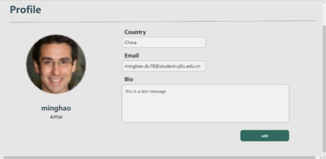

# Wonderland Education Platform

1.Introduction

According to project requirements document discussed in coursework one. Our group plans to complete a web-based e-commerce platform called Wonderland Oversea Education Service Webpage for students who want to apply to study abroad, and for tutors who are qualified to advise and offer useful help. Buyers can place orders on the platform and sellers can take orders on the platform. Therefore, in order to meet the demand in project requirements document, the platform primarily meets the following functions such as: log in and registration, purchase of services, chat room, order management. Further modifications were made for the updated solution. There are more various functions added. The solution of the project is carried to use HTML, PHP, Mysql to implement the e-commerce platform.

2. Project details
1. Overall solution

Figure 2.1: Use case diagram of the Oversea Education Service Webpage

From the use case diagram, we assume that both customers and sellers could be admin and inherit the shared functions.

Figure 2.2: class diagram

Figure 2.3: The buying and selling process

Figure 2.3 is platform interaction flow, on the platform, the user refers to buyer and seller as long as they have an account. Different account correspond to different UI and function. As it can be seen from the diagram, the process is relatively simple, with the buyer and seller logging in the website, browsing the web page, communicating and adding to the shopping cart until they are satisfied with the transaction before the purchase is made.

The overall information structure of the platform is narrow and shallow, for a product that is still expanding its popularity, this structure helps novice users to form an initial structural awareness and users can easily grasp the main structure of the product and be able to use it fluently； The top horizontal bar navigation + tab page structure is adopted, also because users switch between several tabs very frequently during use. In the seller's homepage,

posting products is one of the core functions of the page, and it is reasonable to place it in the middlemost position.

2. Function details

For our code, the files should be organized as follow structure.

1. Login and Sign up

The login and registration page are designed with automatic rotation. User log in to the web site by entering their email and password. Admin check with table user in database when it gets the email and password.

If the email and password match, user log in successful.

If the information is wrong, web page show Email or Password is Wrong!

If the email is null in the database. Web page turn to sign up page. Sign up function is a for new user to register the platform account by enter the email, password\*2, user name. If the email exist, echo Email is already Exists! If the password is not same, echo Two Passwords are not Same!

2. Homepage

Homepage is the first page when user successful login to the website. The home page displays the title of the website,top navigation bar with a search box and buttons for Messages, Cart, Orders and User and other important contents.

3. Search Page

Search\_Page is for customers to search the product (service). customer enter the content in search box, The database returns the matching service descriptions, names, prices, etc. to the customer. If there is no match service, return No Product found in selected criteria.

4. Profile.php and edit.php

The function of this part is to display the user's personal information interface and modify the user's personal information. Profile.php is to display the user's personal information interface. The final result is shown in the figure below.

In this part, you need to read the personal information of the corresponding user from the user table of the database. Some key code as:

It confirms the user to be read through admin. After reading the corresponding data from the database, these information can be displayed in the interface. Some key code as:

The layout of these components is stored in profile.css file. Some key code as:

Edit.php can be started by clicking the Edit button in the profile interface. In this interface, users can modify their personal information, such as nickname, university, email, country, bio and avatar. The final result is shown in the figure below.

The functions of this part are similar to those in the profile. They are to read the data of the corresponding user in the database, and then modify the corresponding information in the database according to the filled contents. Some key code as:

When the user changes the picture, the file selected by the user is copied to a fixed folder, and then the path of the copied picture is saved in the database. Therefore, if there is a problem in the process of reading the picture, the user should check the location of the overall code and make its path corresponding to the path stored in the database.

5. Detail.php, Cart.php, Orders.php and documents related to them

This part is about the process of user purchase, the process is for users to browse the detailed information of goods. Users can choose to chat with the seller or add the goods to the shopping cart. After adding the goods to the shopping cart, they can enter the shopping cart interface, choose to remove the goods or check out, and select the checkout success interface. In this interface, they can choose to view the order status, and in the order interface, they can view all orders, completed orders or ongoing orders. First, detail.php file is used to display product details. The final result is shown in the figure below.

This part of the code needs to read the details of the goods from the service table in the database. Some key code as:

In this interface, there are also the Add to cart button, this functions are realized by cart- add.php. Some key code as:

Users can choose to remove the goods they don't want to buy temporarily in the shopping cart, which can be realized by clicking the remove button in the interface. Some key code as:

After the user adds the goods to the shopping cart, the user can choose to remove the goods or checkout. The final result is shown in the figure below.

In the previous cart-add.php file, the product id and user id are stored in the cart table in the database. In this part of the code, the data of cart table in the database needs to be read and displayed. Some key code as:

After selecting checkout, the user enters the checkout interface. The final result is shown in the figure below.

After the user clicks the view order status button, the user enters the order interface. In this interface, users can see all their own orders. The date, amount and status of the order are displayed here. The final result is shown in the figure below.

In the previous cart interface, click the checkout button to store the information of users, sellers and goods in the orders table in the database. In this part, the data of the orders table in the database needs to be read and displayed. Some key code as:

Orders.php file is the interface to display all order information. The functions of Orders\_Completed file and Orders\_Ongoing file are to display completed orders and orders in progress. In these two parts of code, the status of the order is confirmed according to the status item in the orders table in the database

3. Database details

This platform uses MYSQL database for data storage. There are five tables, named, Cart, User, Service, Service\_category, Order, in the database. The following is the introduction of each table, including field design and description.

1. Table ‘User’

***Table ‘User’***, it keeps track of the user's fundamental information. They have dual identities,

seller and buyer. These two identities, however, should be mutually exclusive (i.e., each user could have one identity only). Other tables are linked to 'User' and use the 'user id' attribute as a foreign key. SQL statements like select \* from service where user id ='zzsoxy78' may be used to index entries.

*Table ‘Services’*, it keeps track of all the services that the sellers has advertised.

2. Table ‘Cart’

***Table ‘Cart’***, it’s short name for shopping cart.

3. Table ‘Service\_category’

***Table ‘Service\_category’***, it categorized the service for more efficient search.

4. Table 'Order'

Finally, ***table 'Order,'*** it keeps account of every transaction between sellers and customers. The status will specify the current trade process, such as submitted, pending, or finished.

3. Justification and evaluation 3.1.Product evaluation

The study abroad service market is different from the previous e-commerce market, where it is assessed by the number of transactions and the efficiency of the transaction, because it is difficult to measure with standards, such as buying a CV, its quality and price are difficult to force the buyer and seller with a standard process. The most prominent feature of the Internet era is that more people are linked, so that people can connect with each other, hence this platform considers developing in the direction of community and building an exchange community for the circulation of study abroad information.

User experience evaluation:

The platform has an overall flat style, with the main colour used being green, which is a refreshing colour and makes the platform easy and enjoyable for users to use; the top bar is consistent throughout the site and users can return to pages they have visited or frequently used through the top bar; the interface is well structured, with clear instructions on each page and a smooth flow of logic between different pages.

Performance evaluation:

- The web pages do not take more than 5 seconds to start and the response time in the web pages does not take more than 3 seconds to run. When the network connection times out, a connection timeout indication is given and the page can be reloaded.
- All pages generated by the system can be connected for no more than 10 seconds using a 40KBps modem; the query results appear on the screen for no more than 7 seconds after the user submits the query to the page.
- During normal use of the webpage, which can accommodate 500 users at the same time; during peak hours, will accommodate 1500 users at the same time.
- The system displays a confirmation message to the user within 4 seconds after the user has submitted information to the system.

Security evaluation:

- Once logged into their account, users can only view product details, chat, search and purchase, in addition to the product menu and information square.
- All internet transactions involving financial information or personally identifiable information are encrypted.
- This page only allows users in the list of authorized sellers to create or edit products.
- The system only allows users to view their previous orders, not orders placed by other users.

Software quality evaluation:

Availability-1: The website is always available to the user and internal maintenance is carried out between 1:00am and 7:00am, without affecting the normal use of the website.

Robustness-1: If a user disconnects from the site during the payment period without confirming or cancelling the order, the site will allow the user to resume the outstanding order.

Compatibility-1: Compatible with many major operating systems and web pages, such as iOS, Android, web pages, etc.

2. Strengths as well as limitations

Strengths

- Fresh colours which give a relaxed and pleasant experience of use and are visually appealing to novice users.
- The release process is made simple and efficient for users to use with high satisfaction.
- The communication function, as a special feature, is the focus of development and may lead to some advertising being done only to sink users for the time being.

Limitations

- Posting pages, where the choice of categories reduces bounces and the option to display categories on the same page reduces bounces.
- The product is not labelled and the user has a certain cognitive load.
- As the number of users grows and users interact frequently, information management needs to be more comprehensive and the platform needs to be strengthened in terms of safeguarding the rights as well as the safety assurance of buyers and sellers.
3. Business case for the project and ethical issues.

In China, if we want to carry out e-commerce activities on a large scale, the ethical and moral issues in this process are a big problem that needs to be solved urgently, and an important factor that restricts the further development of e-commerce. There are various ethical issues in e-commerce activities, of which the report shows that the three most important ones are the proliferation of false information; the lack of guarantee of privacy; and the difficulty of guaranteeing the quality of goods.In view of the above phenomenon and its causes, this paper believes that the solution to the ethical and moral problems of e-commerce must start from the following aspects. First, strengthen the construction of laws, regulations and policies; second, strengthen the construction of the credit system; third, strengthen the education of business ethics and morality for e-commerce practitioners.

Business ethics may seem like an intangible concept, but a lack of business ethics can ultimately cause tangible, real damage. Business ethics is one of the most essential elements to ensure the efficient operation of a market economy. At present, China's market economy has yet to be perfected in this regard; business rules are not yet mature, the business environment is not yet regulated and market regulation is not yet fully in place. But this is not a reason for some companies to indulge in arbitrariness or even to flout ethics and the law. To build a harmonious business environment, we need not only serious laws and strict regulation, but also moral self-discipline and respect for good values. Knowing honour and shame, and building a good reputation and image as a corporate citizen, should be a common pursuit for businesses.

4. Conclusion

In summary, as a C2C service paid application abroad website for study abroad, this platform reduces the cost of students applying to go abroad and gives tutors part-time opportunities. And it fulfils the basic operational functions for the users. At the end this report discusses the of the advantages and possible problems that could arise if it were to actually enter the market. However, due to time constraints and other reasons, the platform can be further improved. (1) there is no security methods for sensitive data. (2) provide more function to enhance user experience.
